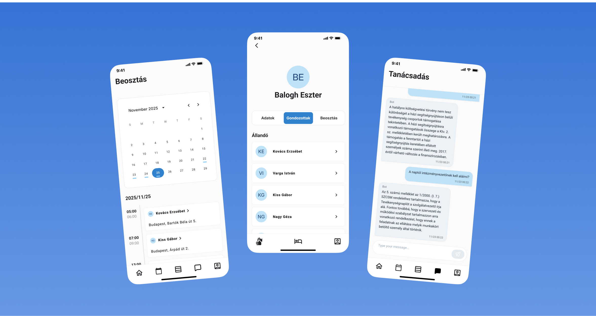
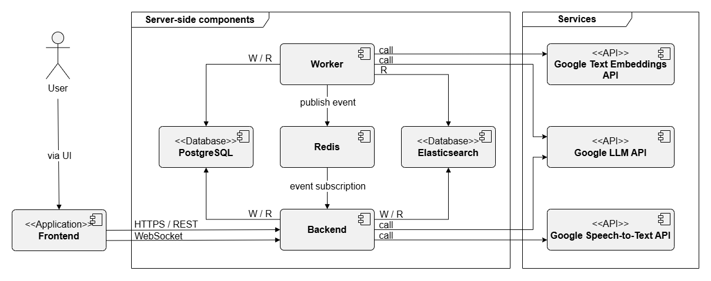

# CareLog - Smart Logging for Social Care




**CareLog** is a specialized digital solution engineered to alleviate the administrative burden within the **Hungarian social care system**. It addresses the critical challenge of time-consuming manual documentation, which often detracts from direct patient care.

By leveraging **Voice-to-Text** technology and **Large Language Models (LLMs)**, CareLog enables care workers to dictate logs and receive intelligent, regulation-compliant advisory support entirely in **Hungarian**.

## 🚀 Key Features

- **Cross-Platform Mobile App**: Built with Ionic and React for a seamless experience on both iOS and Android.
- **Hungarian Voice-First Data Entry**: Care workers can dictate logs directly into the mobile app in Hungarian, saving time and reducing typing effort.
- **AI Knowledge Support (RAG)**: A Retrieval-Augmented Generation module helps navigate complex care protocols and documents, providing instant, context-aware information to support decision-making.
- **Dockerized Deployment**: Fully containerized environment for easy setup and reproducibility.

## 🛠️ Tech Stack

### Frontend
- **Framework**: [React](https://reactjs.org/) + [Ionic](https://ionicframework.com/)
- **State Management**: [Recoil](https://recoiljs.org/)
- **Language**: TypeScript

### Backend
- **Runtime**: [Node.js](https://nodejs.org/)
- **Framework**: [Express.js](https://expressjs.com/)
- **API Spec**: [TSOA](https://tsoa-community.github.io/docs/) (OpenAPI/Swagger)
- **Database**: [PostgreSQL](https://www.postgresql.org/) + [Prisma ORM](https://www.prisma.io/)
- **Language**: TypeScript

### AI / RAG Module
- **Language**: Python
- **LLM**: Google Gemini API
- **Embeddings**: Vector-based document retrieval

## 🏗️ Architecture

The system follows a modern client-server architecture with a specialized microservice for AI processing. The following components are used:
- **Frontend**: React + Ionic
- **Backend**: Node.js + Express.js
- Databases: **PostgreSQL** + **Elasticsearch** (used as a vector database)
- **Worker node** for async tasks: Node.js + Express.js
- **Redis** for message queue
- AI and pre-processing RAG module: Python + Google Gemini API



## 🏁 Getting Started

### Prerequisites

- [Docker compose](https://docs.docker.com/compose/)
- A valid **Google Gemini API Key**

### 1. Clone the Repository

```bash
git clone https://github.com/your-username/carelog.git
cd carelog
```

### 2. Configure Environment

The system requires simple configuration variables.

1. Navigate to `backend/` and create a `.env` file.
2. Add your Google API Key:
   ```env
   GOOGLE_API_KEY=your_api_key_here
   ```

*See [INSTALL.md](./INSTALL.md) for full configuration details.*

### 3. Run with Docker

We provide a specialized script to launch the entire stack in one go.

```bash
# On Linux/Mac
./run.sh

# On Windows
./run.bat
```

Access the applications at:
- **Frontend**: http://localhost
- **Backend API**: http://localhost:8080

## 🧪 Development

### Backend
```bash
cd backend
npm install
npm run dev
```

### Frontend
```bash
cd frontend
npm install
npm run dev
```

For detailed contribution guidelines, please see [CONTRIBUTING.md](./CONTRIBUTING.md).

## 📄 License

This project is licensed under the MIT License - see the [LICENSE](LICENSE) file for details.

---
*Created by Roland Csősz*
